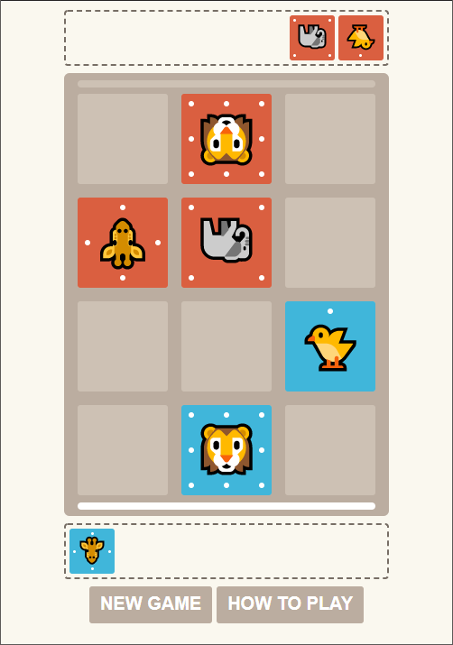

# Animal Chess
[Play!](https://exqt.github.io/animal-chess/)

Origin : [Dobutsu shogi](https://en.wikipedia.org/wiki/D%C5%8Dbutsu_sh%C5%8Dgi)

- 2 Game Modes!
  - VS Bot(Easy, Medium, Hard)
  - Local 2P VS
- Works on mobile!
- Made with Svelte!



## Run
```bash
yarn install
yarn dev
```
## Build
```bash
yarn build
```

## Found a bug?
Feel free to leave a issue on [the Issue Page](https://github.com/exqt/animal-chess/issues)!

## LICENSE
You can only use this for personal usage.
